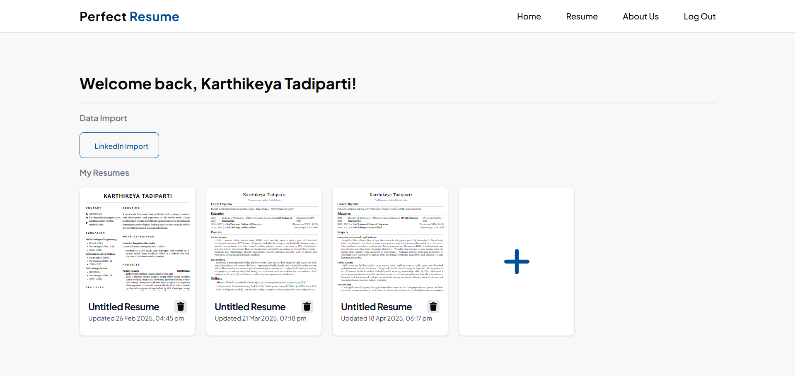

# 💼 Perfect Resume

Perfect Resume is a MERN stack web application that helps users create, customize, and download professional resumes effortlessly. It features real-time editing, LinkedIn data scraping, multiple template options, and one-click PDF export. The platform offers secure authentication and storage, making resume building intuitive and powerful.

---

## 🚀 Live Demo
https://perfect-resume-sable.vercel.app

## 🔍 Features

- 🧑‍🎓 Real-time resume editor with instant preview  
- 🔗 LinkedIn scraping to auto-fill your resume  
- 🎨 Customizable templates and layouts  
- 🖨️ Download resume as high-quality PDF  
- 🔐 JWT-based authentication with cookies and localStorage  
- 📁 Dashboard for managing multiple resumes  

---

## 📄 Pages Description

### 1. **Landing Page**


### 2. **Authentication (Login / Register)**
- User login and sign-up with form validation
- Tokens stored in cookies and localStorage

### 3. **Dashboard**
- Displays all resumes created by the user
- Options to edit, delete, duplicate, or download resumes

### 4. **Resume Editor**
- Modular form sections: Personal Info, Education, Work Experience, Skills, Projects, etc.
- Real-time preview of the resume
- Auto-fill resume data from LinkedIn profile

### 5. **Template Selector**
- Multiple professionally designed templates
- Instantly applies selected template to preview

### 6. **Preview & Download**
- Final preview of the selected resume template
- Option to download as PDF using Puppeteer
- Supabase stores and fetches preview images for faster rendering

---

## 🛠️ Installation Instructions

### 1. Clone the repository

```bash
git clone https://github.com/your-username/perfect-resume.git
cd perfect-resume
```
### 2. Install dependencies
```bash
# Client setup
cd client
npm install

# Server setup
cd server
npm install
```

### 3. Run the application
```bash
# Start server
cd server
npm run dev

# In a new terminal, start client
cd client
npm start
```

